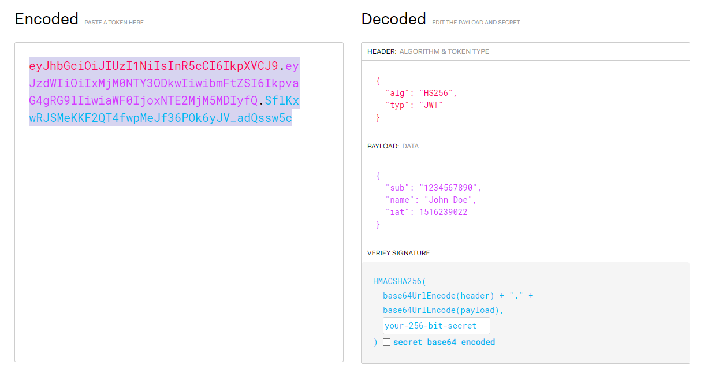

# JWT (JSON Web Token)

Vamos a usar JSON Web Token para autenticar o validar las operaciones dentro de mi API.

## ¿Qué es JWT?

Es un estándar abierto que define una forma compacta y autónoma para transmitir de forma segura la información entre las partes como un objeto JSON. Esta información puede ser verificada y confiable porque está firmada digitalmente.

## ¿Cómo funciona?

El proceso de autenticación consta de 3 partes:

1. El cliente envía sus credenciales (usuario y contraseña) al servidor.
2. El servidor autentica las credenciales y genera un JWT.
3. El usuario que reciba el token puede almacenarlo y enviarlo en cada petición.

## ¿Cómo se ve un JWT?



Un JWT consta de 3 partes:

1. **Header**: Contiene el tipo de token y el algoritmo de encriptación.
2. **Payload**: Contiene la información que queremos transmitir.
3. **Signature**: Es la firma del token que garantiza que el token no ha sido modificado en el camino.

## ¿Cómo se usa un JWT?

Para usar usar JWT en nuestro servidor de Node.js vamos a usar la librería `jsonwebtoken`.

```bash
npm install jsonwebtoken
```

### Crear un archivo de configuración

```js
// jwt.js
const jwt = require("jsonwebtoken"); // Importamos la librería
```

### Crear un token

Para crear el token vamos a usar el método `sign` de la librería `jsonwebtoken`. Este método recibe 3 parámetros:

1. **Payload**: Es la información que queremos transmitir.
2. **PrivateKey**: Es la llave secreta con la que se va a firmar el token.
3. **Options**: Son las opciones que queremos que tenga el token.

Imagemos que los parametros que recibe el método `sign` son los siguientes:

```js
const payload = {
  id: user.id,
  name: user.name,
  email: user.email,
  role: user.role,
};

const privateKey = process.env.JWT_PRIVATE_KEY;

const options = {
  expiresIn: "4h",
  algorithm: "RS256",
};
```

```js
    const jwt = require('jsonwebtoken');

    const generateJWT = (payload) => {

            const token = await jwt.sign(payload, privateKey, options);
            return token;

    }

```

### Variables de entorno

Como se puede observar en el ejemplo anterior, la llave privada se está obteniendo de una variable de entorno. Esto es para que no se suba a un repositorio público y se mantenga segura.

Para eso crearemos un archivo `.env` en la raíz de nuestro proyecto y agregaremos la llave privada.

```bash
JWT_PRIVATE_KEY=mi_llave_privada
```

Para usar las variables de entorno en nuestro proyecto vamos a usar la librería `dotenv`.

```bash
npm install dotenv
```
Una vez instalada la librería, vamos a configurarla en nuestro archivo index.js.

```js
    require('dotenv').config();
```

Para poder acceder a las variables de entorno vamos a usar la variable `process.env`.

```js
    const privateKey = process.env.JWT_PRIVATE_KEY;
```

### Haciendo uso del token

Para hacer uso del token en el login, vamos a dirigirnos a nuestro controlador de `auth.controllers.js` y vamos a importar la función `generateJWT` que acabamos de crear.

```js

const { generateJWT } = require("../config/jwt");


const loginUser = async (req, res) => {
  try {
    // 1. Buscamos el usuario en la base de datos
    const user = await User.findOne({
      where: {
        email: req.body.email,
      },
    });

    // Si no existe el usuario
    if(!user){
        return res.status(400).json({
            ok: false,
            msg: 'El usuario no existe',
            data: null
        });
    }

    // 2. Comparamos la contraseña
    const validPassword = bcrypt.compareSync(req.body.password, user.password); // Comparamos la contraseña

    // Si la contraseña no es válida
    if(!validPassword){
        return res.status(400).json({
            ok: false,
            msg: 'Contraseña incorrecta',
            data: null
        });
    }

    // 3. Devolvemos los datos del usuario
    user.password = undefined; // Eliminamos el campo password

    // 4. Generamos el token  TODO: Generar el token
    const token = generateJWT(user.toJSON()); // Generamos el token

    return res.status(200).json({
        ok: true,
        msg: 'Inicio de sesión correcto',
        data: user,
        token
    });


  } catch (error) {
    console.log(error);
    return res.status(500).json({
      ok: false,
      msg: "Error en el servidor",
      data: null,
    });
  }
};


```

### Validar el token

Para validar el token vamos a crear un middleware que se va a encargar de validar el token en cada petición.

#### Middleware

Los middlewares son funciones que se ejecutan antes de que lleguen a los controladores. Estas funciones tienen acceso al objeto `request` y al objeto `response` y pueden modificarlos.

Vamos a crear una carpeta dentro de `src` llamada `middlewares` y dentro de ella vamos a crear un archivo llamado `validate-jwt.js`.

Será necesario además acceder al token que viene en el header de la petición. Tengamos en cuenta que el header de la petición tendra la siguiente ruta req.headers.authorization.

```js

const jwt = require("jsonwebtoken");

const validateJWT = (req, res, next) => {
  try {
    const token = req.headers.authorization.split(" ")[1]; // Obtenemos el token del header de la petición

    const payload = jwt.verify(token, process.env.JWT_PRIVATE_KEY); // Verificamos el token

    req.user = payload; // Guardamos el payload en el objeto request

    next(); // Continuamos con el flujo de la aplicación
  } catch (error) {
    console.log(error);
    return res.status(401).json({
      ok: false,
      msg: "Token no válido",
      data: null,
    });
  }
};