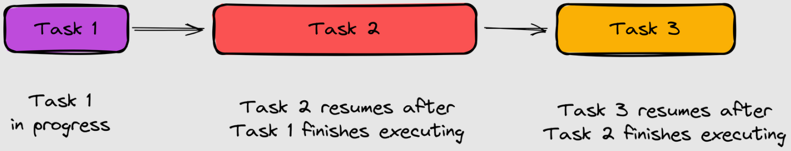
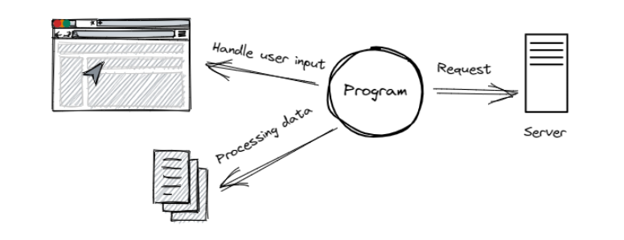
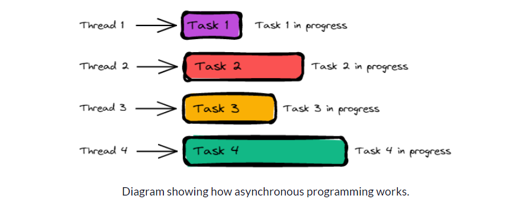

# Asincronismo en JavaScript

En este material veremos la importancia del asincronismo en JavaScript. Para ello, veremos los siguientes temas:

## Tabla de Contenido

- [Asincronismo en JavaScript](#asincronismo-en-javascript)
  - [Tabla de Contenido](#tabla-de-contenido)
  - [¿Qué es el asincronismo?](#qué-es-el-asincronismo)
  - [¿Cómo creamos código asíncrono en JavaScript?](#cómo-creamos-código-asíncrono-en-javascript)
    - [Callbacks](#callbacks)

## ¿Qué es el asincronismo?

Antes que nada, veremos que un programa **síncrono** es aquel que se ejecuta de forma secuencial, es decir, que una tarea se ejecuta después de la otra. Por ejemplo, si tenemos un programa que tiene las siguientes tareas:

1. Descargar un archivo de Internet.
2. Guardar el archivo en disco.
3. Reproducir el archivo descargado.



En un programa síncrono, la tarea 2 no se ejecutará hasta que la tarea 1 haya terminado, y la tarea 3 no se ejecutará hasta que la tarea 2 haya terminado. Esto es un problema, ya que si la tarea 1 tarda mucho tiempo en ejecutarse, la tarea 2 y 3 no se ejecutarán hasta que la tarea 1 haya terminado. Sin embargo, el software moderno debe ser capaz de realizar múltiples tareas al mismo tiempo, por lo que este modelo de ejecución secuencial no es viable.



Para solucionar este problema, se creó el **asincronismo**. En un programa asíncrono, la tarea 2 se ejecutará al mismo tiempo que la tarea 1, y la tarea 3 se ejecutará al mismo tiempo que la tarea 2. Esto es posible gracias a que el asincronismo permite que una tarea se ejecute en segundo plano, sin interrumpir el flujo principal del programa.

Para saber qué es el **asincronismo** en el desarrollo de software, debemos entender primero qué es la **concurrencia**. La concurrencia es la capacidad que tiene un programa para realizar más de una tarea al mismo tiempo. Por ejemplo, cuando estamos descargando un archivo de Internet, podemos estar escuchando música al mismo tiempo. Esto es posible gracias a la concurrencia.




**En resumen:**

- El **asincronismo** un modelo de *concurrencia* y un *modelo de computación* en el cual un proceso no necesita esperar a que el anterior termine para poder ejecutarse.
- El **asincronismo** nos permite realizar tareas en *segundo plano* y no interrumpir el flujo principal del programa.
- El **asincronismo** es la base de la programación *reactiva* y *funcional* en JavaScript.
- El **asincronismo** es la base de la programación *no bloqueante* en JavaScript.

## ¿Cómo creamos código asíncrono en JavaScript?

En JavaScript, podemos crear código asíncrono de dos formas:

- Mediante **callbacks**.
- Mediante **promesas**.

### Callbacks

Un **callback** es una función que se pasa como parámetro a otra función, y que se ejecuta una vez que se ha completado una tarea asíncrona. Por ejemplo, si tenemos una función que descarga un archivo de Internet, podemos pasarle como parámetro una función que se ejecutará una vez que el archivo se haya descargado.

```js
function descargarArchivo(url, callback) {
  // Descargar archivo...
  callback();
}

descargarArchivo('https://ejemplo.com/archivo.pdf', function() {
  console.log('El archivo se ha descargado correctamente.');
});
```

En el ejemplo anterior, la función `descargarArchivo` recibe como parámetro una función que se ejecutará una vez que el archivo se haya descargado. Esta función se conoce como **callback**.
