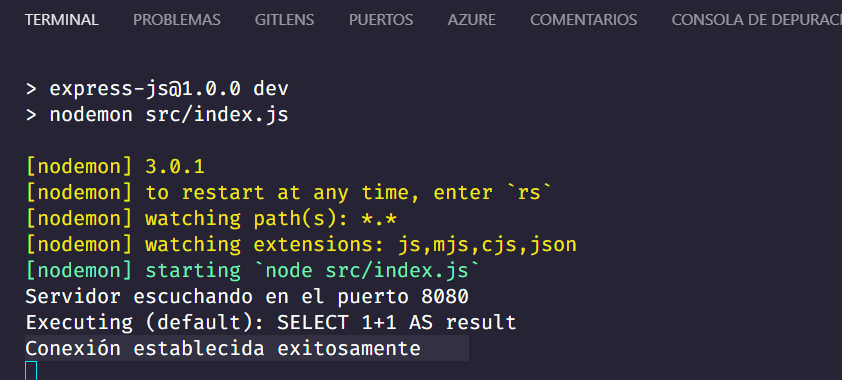

# Integración de base de datos con Sequelize y mysql2

## Instalación de dependencias

Para instalar las dependencias de Sequelize y mysql2, ejecutar el siguiente comando:

```bash
npm install sequelize mysql2
```

- `sequelize`: ORM para Node.js que permite trabajar con bases de datos relacionales.
- `mysql2`: Driver para MySQL que permite la conexión con la base de datos.

Nota: Sequelize soporta otros drivers para otras bases de datos relacionales, como PostgreSQL, SQLite, Microsoft SQL Server, MariaDB, etc.

## Configuración de Sequelize

Vamos a crear un archivo de configuración para Sequelize, que se llamará `sequelize.js` y estará ubicado en la carpeta `config`. Este archivo tendrá la siguiente estructura:

```js
// importo sequelize
const Sequelize = require("sequelize");

// creo una instancia de sequelize con la configuración de la base de datos montada con XAMPP

//Cuando creamos una instancia de sequelize, le pasamos como parámetros el nombre de la base de datos, el usuario y la contraseña de la base de datos, y un objeto con la configuración del host y el dialecto de la base de datos. En este caso, el host es localhost y el dialecto es mysql.

const sequelize = new Sequelize("instaibec", "root", "", {
  host: "localhost",
  dialect: "mysql",
});

// exporto la instancia de sequelize para poder importarla en otros archivos
module.exports = sequelize;
```

Los parámetros que recibe el constructor de Sequelize son:

- El nombre de la base de datos,
- el usuario y la contraseña de la base de datos
- un objeto con la configuración del host y el dialecto de la base de datos. En este caso, el host es localhost y el dialecto es mysql.
  ```javascript
  {
        host: 'localhost',
        dialect: 'mysql'
  }
  ```

## Conexión a la base de datos

Para conectarnos a la base de datos vamos a ejecutar el método `authenticate()` de la instancia de Sequelize que creamos en el archivo de configuración. Este método devuelve una promesa, por lo que podemos usar `then()` y `catch()` para manejar los casos de éxito y error respectivamente.

```javascript
const Sequelize = require("sequelize");

const sequelize = new Sequelize("instaibec", "root", "", {
  host: "localhost",
  dialect: "mysql",
});

sequelize
  .authenticate()
  .then(() => {
    console.log("Conexión establecida exitosamente");
  })
  .catch((err) => console.log(err));

module.exports = sequelize;
```

- Si la conexión es exitosa, se mostrará el mensaje "Conexión establecida exitosamente" en la consola.
- Si la conexión falla, se mostrará el error en la consola.
- El método `authenticate()` devuelve una promesa, por lo que podemos usar `then()` y `catch()` para manejar los casos de éxito y error respectivamente.

Si todo salió bien deberíamos ver el siguiente mensaje en la consola, una vez que hayas ejecutado tu archivo `index.js`:

```bash
npm run dev
```

o si no configuraste el script de dev:

```bash
nodemon index.js
```




