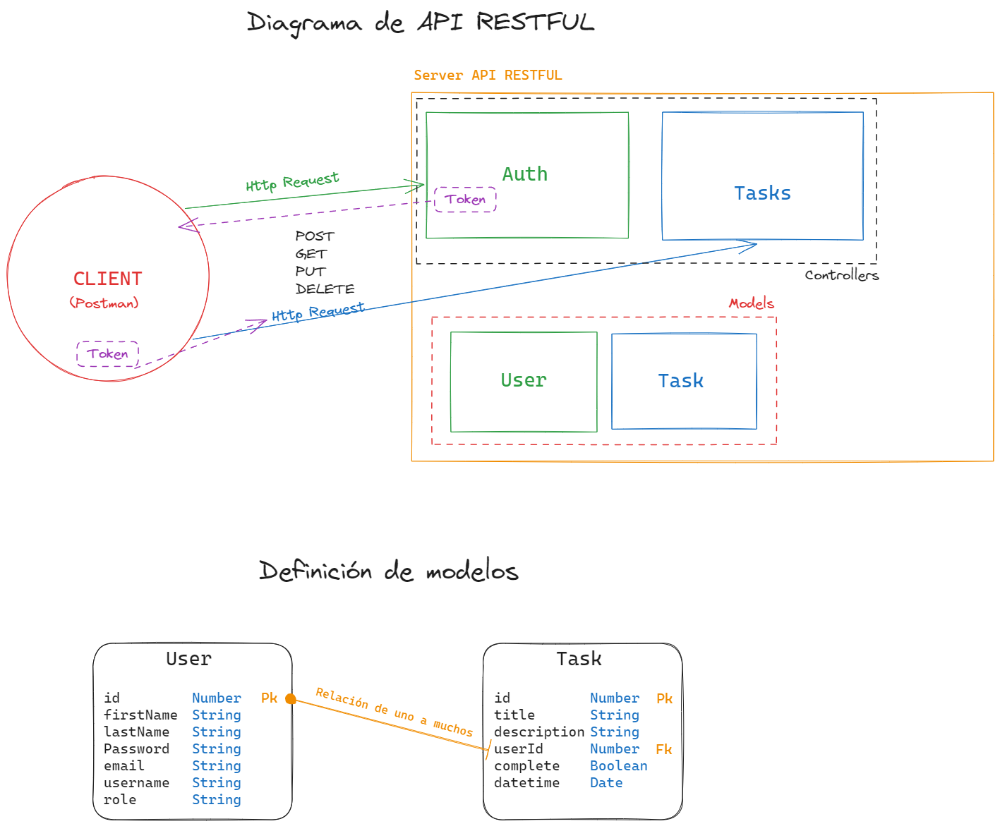
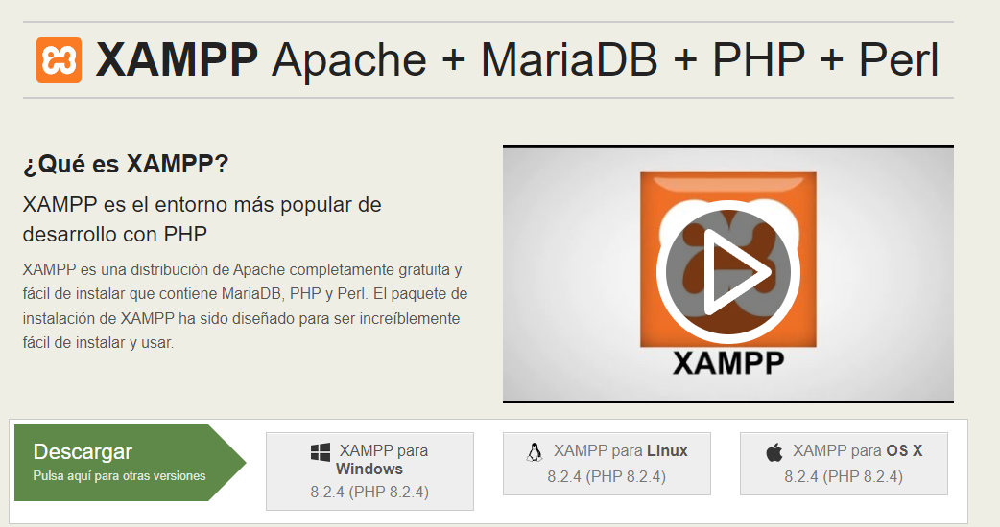
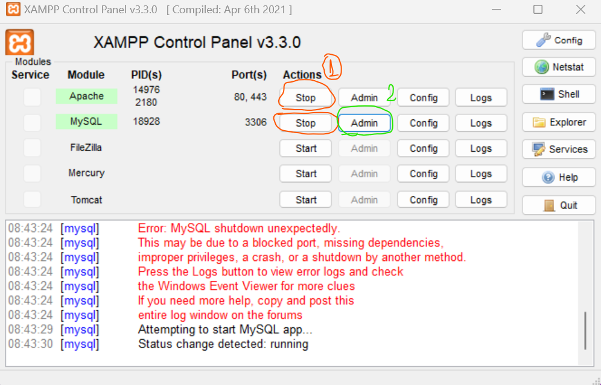
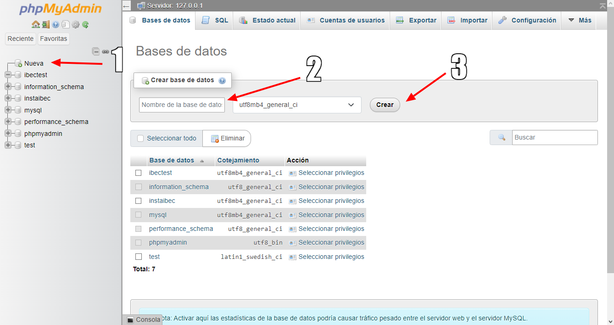

# Guía de Evaluación Backend

## Enunciado:

**Construir una API RESTful para gestionar una lista de tareas (to-do list).**

### Descripción:

- Tu objetivo es construir una API RESTful utilizando Node.js, Express y mySql con
  Sequelize para gestionar una lista de tareas. La API debe permitir realizar las
  siguientes operaciones:
  ● Registrar un usuario.
  ● Iniciar sesión de usuario con email y contraseña.
  ● Crear una nueva tarea: La API debe permitir crear una nueva que esté asignada a un
  usuario en particular.
  ● Obtener todas las tareas: La API debe proporcionar un punto de acceso para obtener
  todas las tareas existentes en la base de datos que pertenezcan a un usuario en
  particular.
  ● Obtener una tarea específica: La API debe proporcionar un punto de acceso para
  obtener los detalles de una tarea específica, dado su identificador único.
  ● Actualizar una tarea: La API debe permitir actualizar los detalles de una tarea existente,
  incluyendo su título y descripción.
  ● Eliminar una tarea: La API debe permitir eliminar una tarea existente, dado su
  identificador único.

### Instrucciones:

1. Configura un proyecto Node.js con Express y mySql.
2. Define los modelos y esquemas necesarios para representar una tarea en la base de
   datos.
3. Implementa las rutas y controladores necesarios para cada operación descrita
   anteriormente.
4. Prueba tu API utilizando herramientas como curl, Postman o Insomnia para verificar
   que todas las operaciones funcionen correctamente.
5. Considera aspectos como la validación de datos, el manejo de errores y la seguridad al
   diseñar tu API. (No entra JWT)

### Recursos adicionales:

Documentación oficial de Express.js: https://expressjs.com/
Documentación oficial de Sequelize https://sequelize.org/
¡Buena suerte!

## Pasos a seguir

### Planificar el proyecto

Es recomendable iniciar un breve diagrama de nuestra API en la cual explicaremos su estructura, interacción y funcionalidad. Además, es importante definir los modelos y esquemas necesarios para representar una tarea en la base de datos.



### Configurar el proyecto

Vamos a iniciar un proyecto nuevo con el comando `npm init -y` y luego instalaremos las dependencias necesarias para el proyecto.

* `npm init -y`: Inicia un proyecto nuevo con un archivo `package.json` con la configuración por defecto.

```bash
    npm i express mysql2 sequelize dotenv jsonwebtoken bcryptjs
```

Ademas instalaremos las dependencias de desarrollo:

Vamos a instalar `nodemon` para que nuestro servidor se reinicie cada vez que guardemos un cambio en el código. Pero no olvidar que `nodemon` es una dependencia de desarrollo que antes debe estar instalada de forma global en nuestra computadora

###### Comando de instalación global

```bash
    npm i -g nodemon
```

###### Comando de instalación local

```bash
    npm i -D nodemon
```

* `npm i -D nodemon`: Instala `nodemon` como dependencia de desarrollo al colocar una bandera `-D` o `--save-dev` en el comando de instalación.

### Definir la estructura de mi repositorio

Vamos a crear la estructura de nuestro proyecto, para ello vamos a crear las carpetas `src` y `db` en la raíz de nuestro proyecto.

La estructura de nuestro proyecto debería verse así:

```bash
    ├── src
    │   ├── controllers
    ├── ├── ├──auth.controller.js
    ├── ├── ├──task.controller.js
    │   ├── routes
    ├── ├── ├──auth.routes.js
    ├── ├── ├──task.routes.js
    │   ├── models
    ├── ├── ├──db.js
    ├── ├── ├──task.model.js
    ├── ├── ├──user.model.js
    │   ├── middlewares
    ├── ├── ├──validate-jwt.js
    │   ├── config
    ├── ├── ├──jwt.js
    ├── ├── ├── sequalize.js
    ├── index.js
    ├── .env
    ├── .gitignore
    ├── package-lock.json
    ├── package.json
    └── README.md
```

### Configurar la base de datos

Vamos a levantar una base de datos de forma local con XAMPP, para ello vamos a instalarlo desde su [página oficial](https://www.apachefriends.org/es/index.html).



Una vez instalado vamos a iniciar los servicios de `Apache` y `MySQL` y luego vamos a ingresar a `phpMyAdmin` para crear una base de datos nueva.



Es necesario hacer click en el botón `Nuevo` para crear una base de datos nueva. Elegir el nombre de la base de datos y luego hacer click en el botón `Crear`.




### Configurar Sequelize y crear los modelos

#### Configurar Sequelize
Para configurar `Sequelize` vamos a seguir todos los pasos de el apunte de la clase 4.

#### Crear los modelos

Para configurar los modelos, vamos a seguir los pasos de el apunte de la clase 5.